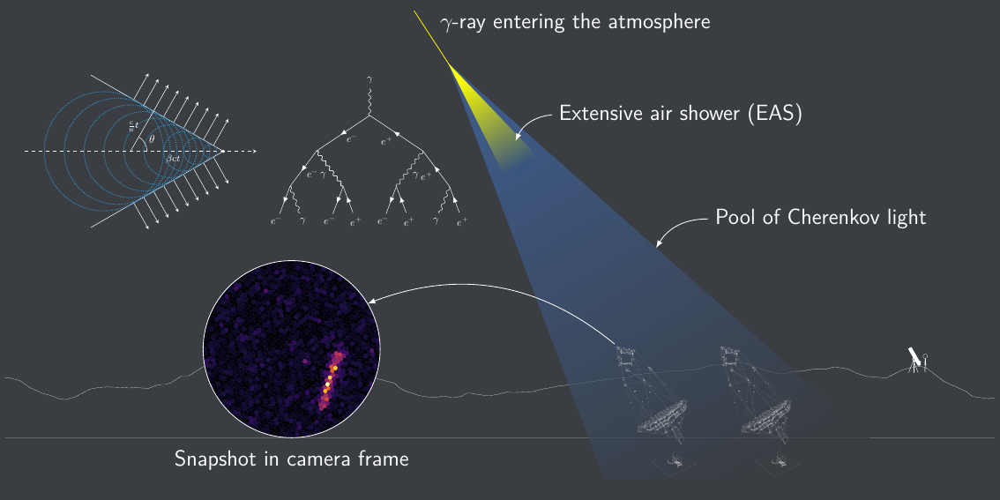

# IACT

TikZ graphic depicting a gamma-ray induced extensive air shower captured by 
Medium-Sized Telescopes (MST) of the Cherenkov Telescope Array (CTA).
From my [bachelor's thesis talk](https://github.com/aknierim/BA_talk).
Simply calling `make` will also convert this graphic to SVG using inkscape.

